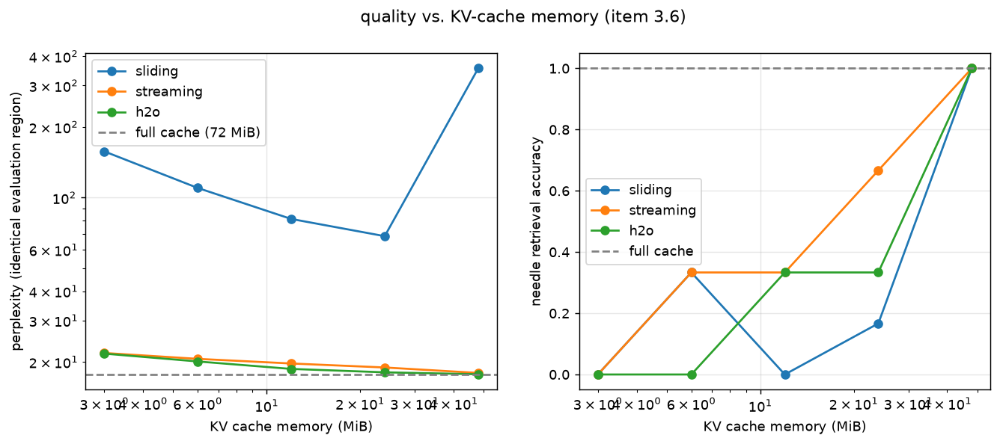

# Attention-Aware KV Cache Compression

A runnable solution to task 3 using **Qwen2.5-0.5B-Instruct**, real model weights,
a cache we can inspect, and measured attention, perplexity, retrieval, and memory.
Start with [the writeup](WRITEUP.md) and [the measured results](results/REPORT.md).

## Deliverables

| Item | Implementation | Evidence |
|---|---|---|
| 3.1 Model, KV states, attention | `kvcache/model.py`, `cache.py` | HF reference harness and `results/correctness_float32.json` |
| 3.2 Instrument attention first | `scripts/instrument_attention.py` | `results/attention_stats.json`; layer/head heatmaps in `plots/` |
| 3.3 Three policies | `kvcache/policies.py` | Policy tests; loss-over-time and retrieval plots |
| 3.4 Positions after eviction | `kvcache/rope.py`, `model.py` | Algebraic tests and `results/rope_ablation.json` with retained-needle checks |
| 3.5 Long-document PPL + NIAH | `scripts/eval_ppl.py`, `eval_niah.py` | Two documents; full-cache control; individual answers and retention records |
| 3.6 Quality/memory curves | `scripts/run_curve.py` | `plots/quality_vs_memory.png`, `results/curve.json` |
| 3.7 Explanation and recommendations | `WRITEUP.md` | Measured findings, theory, and limitations |
| Stretch (partial) | Per-KV-head token selection; configurable per-layer budgets | Regression tests; unequal per-head capacities are not implemented |

## Setup

Python 3.11 is tested. No training, API key, or paid inference service is needed.

```bash
python3.11 -m venv .venv
source .venv/bin/activate
pip install -r requirements.txt
python data/get_data.py
```

The downloader strips Gutenberg headers/footers. Evaluation starts at each book's
first prose sentence, excluding title pages and tables of contents. Token counts
and SHA-256 hashes of the evaluated source texts are recorded in the curve JSON.

The default model is `Qwen/Qwen2.5-0.5B-Instruct`. Download once while online:

```bash
python -c 'from huggingface_hub import snapshot_download; snapshot_download("Qwen/Qwen2.5-0.5B-Instruct")'
```

The reproduction driver uses that local cache in offline mode. Standalone scripts
also accept a local model directory or another supported Qwen2 model via `--model`.
Only ordinary Qwen2 RoPE is supported, not scaled RoPE or other architectures.

## Reproduce

```bash
# Fast, meaningful regression tests; random tiny weights, no download.
python -m pytest -q
python -m tests.test_correctness

# Entire measured configuration: Apple GPU. Use DEVICE=cpu or DEVICE=cuda as appropriate.
DEVICE=mps bash run_all.sh

# Resume individual stages after a failure.
python -m scripts.complete --stages attention,curve,rope,benchmark --device mps
python -m scripts.report
```

The measured suite uses full precision on Apple GPU, attention over 2,048 tokens,
two 3,072-token documents, 2,048-token retrieval prompts, budgets
128/256/512/1024/2048, three needle depths, and two paired passkeys per depth.
Stage logs are saved in `results/logs/`; the curve JSON is checkpointed after
every configuration and has a completion flag. Runtime depends on hardware.

Standalone examples:

```bash
python -m scripts.instrument_attention --n_tokens 2048
python -m scripts.eval_ppl --policy streaming --budget 512
python -m scripts.eval_niah --policy h2o --budget 512 --ctx 2048
python -m scripts.rope_ablation --policy streaming --budget 512 --ctx 2048
python -m scripts.run_curve --texts data/pride_and_prejudice.txt,data/frankenstein.txt --budgets 128,256,512,1024,2048 --n_tokens 3072 --ctx 2048
```

For an end-to-end script smoke test, pass `--model tiny` with an existing text
file. Tiny weights verify plumbing only; their quality scores are not evidence.
Keep NIAH contexts at least 512 tokens and attention contexts at least 2 tokens.
Do not mix tiny smoke outputs with the measured result directory.

## Cache and position contract

- Batch size 1. `model.hf` exposes the standard HF `past_key_values` API.
  `runner.cache.layers[i]` exposes our K, V, original positions, and scores.
- `recompute` stores **pre-RoPE** keys and rotates retained keys at contiguous
  cache positions before attention. These tensors are not directly interchangeable
  with HF's post-RoPE cache.
- `absolute` consistently uses original positions, preserving gaps.
  `stale` intentionally mixes cached insertion-time rotations with compacted
  query positions and exists only as a negative control.
- Eviction reserves incoming space **before attention**, so every layer's
  materialized cache has at most its budget's entries. `chunk_size=32` is a
  block approximation; use 1 for online eviction. The chunk is capped to fit.
- `prefill()` retains only the final logits, and `feed_nll()` computes losses
  by chunk. Diagnostic `feed()` intentionally retains all logits.
- Cache-byte measurements include K and V. Position/score metadata is reported
  separately. Weights, temporary copies, and attention workspaces are additional.
- Per-layer capacities can be supplied as
  `StreamingRunner(model, make_policy("h2o"), layer_budgets=[...] )`, with one
  positive capacity per layer. Compare allocations at equal summed capacity.
- Full precision is the validated configuration. Half precision is experimental:
  the Apple GPU run showed larger positional-shift rounding differences and was
  excluded from the reported quality experiments.

## Read the evidence



[Loss over time](plots/perplexity_over_time.png) shows the sliding-window failure;
[retrieval by depth](plots/retrieval_by_depth.png) shows when facts disappear.
The RoPE experiment verifies that every needle is physically retained in every
layer/KV head before it attributes differences to position handling.

## References

- [StreamingLLM — Xiao et al.](https://arxiv.org/abs/2309.17453)
- [H2O — Zhang et al.](https://arxiv.org/abs/2306.14048)
- [StreamingLLM reference implementation](https://github.com/mit-han-lab/streaming-llm)
